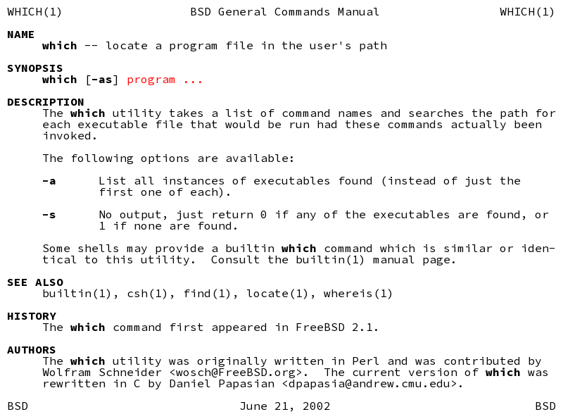

==========
term2image
==========

Read the output of a terminal command like "man" or "ls" and write a PNG.

.. code-block:: none

  usage: term2image [-h] [-i INFILE] [-o OUTFILE]

  Convert terminal command output to an image

  optional arguments:
    -h, --help            show this help message and exit
    -i INFILE, --infile INFILE
    -o OUTFILE, --outfile OUTFILE

Example
=======

Output of ``man which | term2image -o which.png``:

